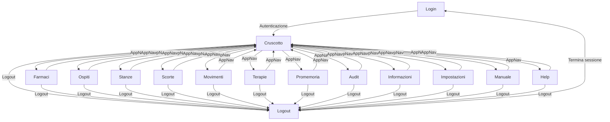
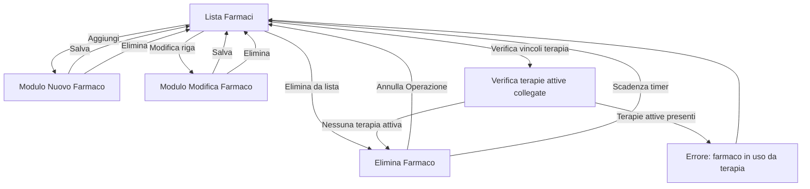
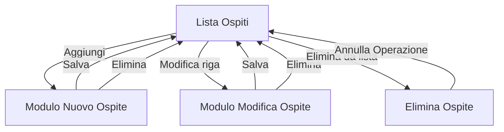
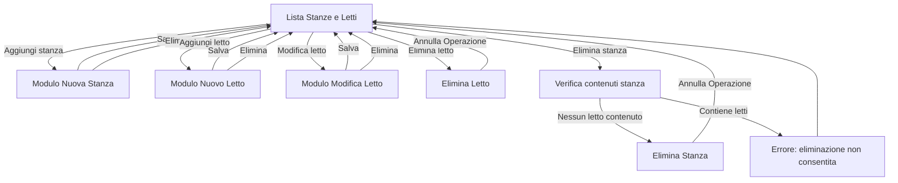
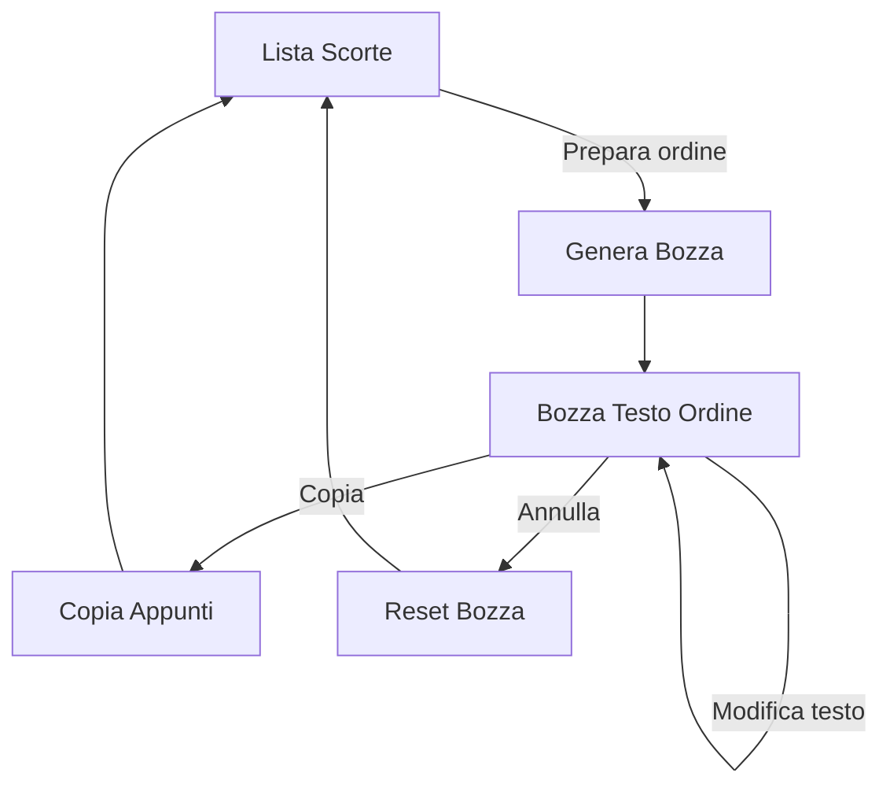
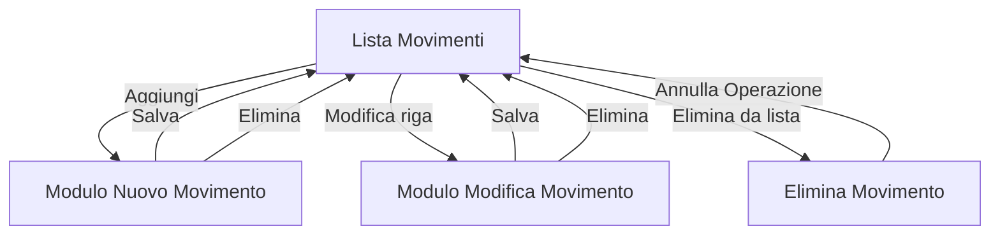
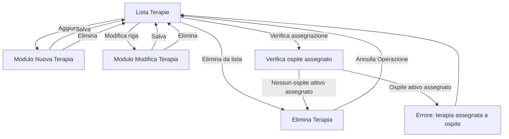
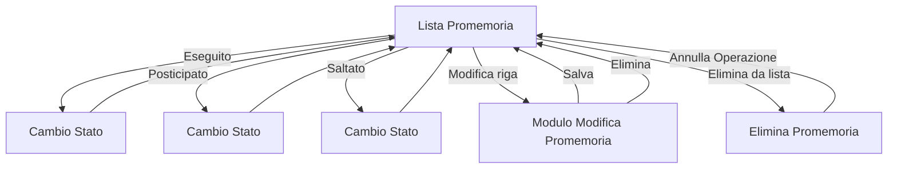

# Flussi di Navigazione MediTrace

Documentazione completa della navigazione globale e dei flussi interni di Aggiungi/Modifica per ciascuna vista.

---

## 1. Navigazione tra Viste Principali

Diagramma della navigazione globale: come l'utente si muove tra le viste principali attraverso la barra di navigazione (AppNav).



**Flusso Principale:**
- Utente fa login -> accesso a Cruscotto (home dashboard).
- Dalla barra di navigazione (AppNav), accede a qualsiasi vista.
- Da qualsiasi vista, torna al Cruscotto o accede direttamente alle altre viste.
- Pulsante Logout disponibile ovunque -> logout e ritorno a login.

---

## 2. Flussi Interni: Aggiungi/Modifica per Ciascuna Vista

Diagrammi separati per vista, con i flussi effettivi del codice.

Legenda traduzioni usata nei diagrammi:
- Save = Salva
- Cancel = Elimina
- Undo = Annulla Operazione
- Form = Modulo

### Farmaci



Messaggio errore previsto per il vincolo farmaco-terapia:
- Non e' possibile eliminare il farmaco "xx" in quanto contiene ancora oggetti di tipo terapia attiva (elenco terapie collegate).

### Ospiti



### Stanze



Messaggio errore previsto per il vincolo CRUD parent-child:
- Non e' possibile eliminare xx in quanto contiene ancora oggetti di tipo yyy (elenco degli oggetti contenuti).

### Scorte



### Movimenti



### Terapie



Messaggio errore previsto per il vincolo terapia-ospite:
- Non e' possibile eliminare la terapia "xx" in quanto contiene ancora oggetti di tipo ospite assegnato (elenco assegnazioni).

### Promemoria



---

## Pattern Riassuntivi

### Pattern CRUD Standard (Farmaci, Ospiti, Movimenti, Terapie)

```text
Lista (read)
  - Aggiungi -> Modulo -> Salva/Elimina -> Lista
  - Click Row -> Modifica -> Modulo -> Salva/Elimina -> Lista
  - Elimina (riga o selezione) -> verifica vincoli -> Annulla Operazione
```

### Pattern Multi-Entity (Stanze)

```text
Lista (read)
  - Aggiungi Stanza -> Modulo -> Salva/Elimina -> Lista
  - Aggiungi Letto -> Modulo -> Salva/Elimina -> Lista
  - Click Letto -> Modifica -> Modulo -> Salva/Elimina -> Lista
  - Elimina Letto -> Annulla Operazione
  - Elimina Stanza -> Verifica contenuti:
      - se contiene letti -> errore con elenco letti
      - se non contiene letti -> elimina -> Annulla Operazione
```

### Pattern Editable Draft (Scorte)

```text
Lista
  - Prepara Ordine -> Bozza -> Modifica -> Copia/Annulla -> Lista
```

### Pattern State-Change (Promemoria)

```text
Lista
  - State Change (Eseguito/Posticipato/Saltato) -> Lista
  - Modifica -> Modulo -> Salva/Elimina -> Lista
  - Elimina (da lista) -> Annulla Operazione
```

---

## Componenti UI Utilizzati

- AppNav.vue: Navigazione globale (viste principali + Logout).
- Pannelli Collapsibili: details HTML per toggle lista/modulo.
- ConfirmDialog.vue: Conferma per azioni distruttive.
- TextArea (Scorte): Bozza ordine modificabile con copia appunti.
- Moduli validati: Validazione, error display, submit handling.

---

## Note Implementative

1. Ogni vista mantiene stato panelMode (list/create/edit).
2. Le azioni di eliminazione usano undo con timeout dove previsto.
3. Vincolo CRUD parent-child in Stanze: una stanza non e' eliminabile se contiene letti non eliminati.
4. In caso di blocco eliminazione stanza, viene mostrato errore con elenco dei letti contenuti.
5. Vincolo CRUD parent-child in Farmaci: un farmaco non e' eliminabile se referenziato da terapie attive.
6. Vincolo CRUD parent-child in Terapie: una terapia non e' eliminabile se assegnata a un ospite attivo.
7. Logout globale disponibile da AppNav.
