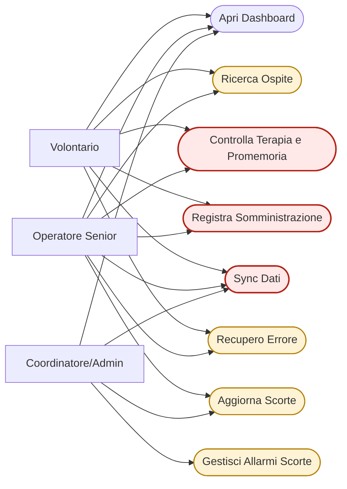
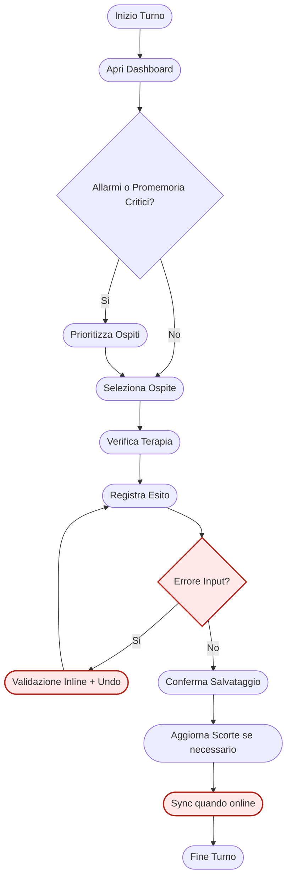
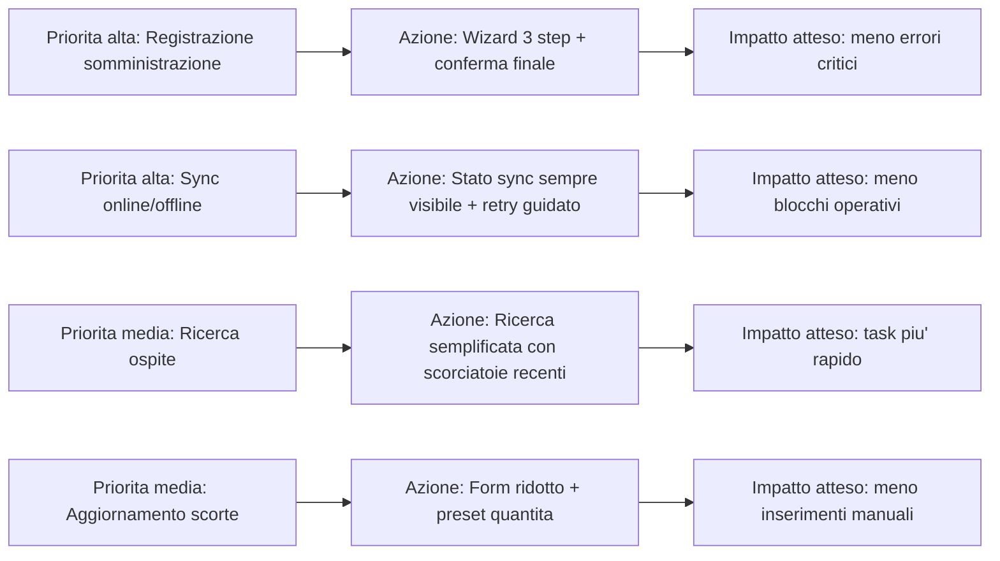

# MediTrace Operationalization Playbook

Data: 2026-03-31
Ambito: stabilizzazione operativa dopo rilascio PWA + sync GitHub Gist + deploy GitHub Pages

## Obiettivo

Passare da implementazione funzionante a esercizio operativo ripetibile e controllato:

- test automatici frontend e sync affidabili
- segreti tecnici e credenziali operative gestiti correttamente
- policy di merge protette
- evidenze di rilascio tracciabili

## Prerequisiti

- Deploy GitHub Pages attivo e accessibile.
- Utenza/password operatore attive e funzionanti.
- Segreto tecnico GitHub per sync Gist disponibile e non scaduto.
- Workflow GitHub presente per build e smoke test PWA.

## Fase 1: Attivazione CI Build + Smoke

1. Aprire GitHub repository settings.
2. Andare su Secrets and variables > Actions.
3. Configurare le variabili e i secrets repository necessari al deploy.
4. Lanciare workflow manuale build + smoke test PWA.
5. Verificare esito positivo su build, lint e smoke di bootstrap app.
6. Lanciare smoke test multi-device simulato, se disponibile.
7. Verificare quality gate automatico (`test`) su branch protetto `main`.

Criterio di uscita:

- build green
- smoke green
- deploy preview raggiungibile

## Fase 2: Igiene Segreti e Credenziali Operative

1. Verificare che il segreto tecnico GitHub per sync abbia solo scope `gists` e non scada a breve.
2. Verificare policy password operative (complessita', cambio periodico, revoca account dismessi).
3. Ruotare i segreti tecnici almeno ogni 90 giorni o immediatamente in caso di sospetta compromissione.
4. Aggiornare le configurazioni ambiente in GitHub se la repo o l'owner del Gist cambiano.
5. Rieseguire smoke build e bootstrap login.
6. Revocare segreti obsoleti o non piu' utilizzati.

Nota:

- non committare mai credenziali reali nei file del repository.
- mantenere i valori sensibili solo in secret store e password manager.

## Fase 3: Protezione Branch Main

1. Abilitare branch protection su main.
2. Richiedere status check obbligatorio prima del merge.
3. Impostare come required check il workflow `test` (unit+coverage, E2E, build).
4. Abilitare blocco merge in caso di check non riusciti.
5. Opzionale consigliato: richiedere almeno 1 review umana.

Criterio di uscita:

- nessuna PR puo' essere mergiata su main con build o smoke rosso.

## Fase 4: Allineamento Deploy E Sync

1. Verificare differenze tra documentazione e implementazione PWA reale.
2. Confermare che il bootstrap crei correttamente `meditrace-manifest.json` e `meditrace-data.json` nel Gist privato.
3. Confermare che il resume dell'app scarichi un dataset remoto piu' recente.
4. Rieseguire smoke e aggiornare evidenze.

Criterio di uscita:

- documentazione e comportamento runtime allineati.

## Fase 4.1: Procedura Standard Update Dataset Realistico

Obiettivo: aggiornare `pwa/src/data/realisticDataset.json` senza introdurre regressioni nel seed automatico e nei test E2E.

Procedura:

1. Preparare il nuovo file JSON con le quattro collezioni obbligatorie: `rooms`, `beds`, `hosts`, `therapies`.
2. Verificare campi obbligatori:
   - `rooms`: `id`, `codice`, `descrizione`
   - `beds`: `id`, `roomId`, `numero`, `occupato`
   - `hosts`: `id`, `codiceInterno`, `nome`, `cognome`, `patologie`, `roomId`, `bedId`
   - `therapies`: `id`, `hostId`, `drugId`, `dataInizio`, `dosaggio`, `frequenza`
3. Verificare integrita' referenziale nel file sorgente:
   - ogni `beds[].roomId` deve esistere in `rooms[].id`
   - ogni `hosts[].roomId` e `hosts[].bedId` deve esistere
   - ogni `therapies[].hostId` deve esistere in `hosts[].id`
4. Sostituire `pwa/src/data/realisticDataset.json` e rieseguire la suite minima:
   - `npm --prefix pwa run test:unit -- seedDataRealistic.spec.js`
   - `npm --prefix pwa run test:e2e`
5. Aggiornare la documentazione dataset/fixture se cambiano cardinalita' o regole:
   - `pwa/tests/e2e/fixtures/README.md`
   - `pwa/tests/e2e/fixtures/REALISTIC_SEED_USAGE.md`
6. Preparare commit separati consigliati:
   - commit 1: solo dataset (`realisticDataset.json`)
   - commit 2: mapping/test/docs correlate

Criterio di uscita:

- validazione dataset in `seedDataRealistic.js` verde
- test unitari mapping verdi
- regressione E2E completa verde

## Fase 5: Rilascio Operativo

Checklist minima pre-rilascio:

- build green
- smoke multi-device green oppure rischio documentato
- credenziali operative e segreto tecnico di sync verificati
- branch protection attiva
- documentazione architetturale aggiornata
- evidenze test archiviate in docs

Checklist post-rilascio (24-72h):

- monitorare errori login, sessione operatore e GitHub API nei log client
- verificare che almeno due dispositivi leggano lo stesso dataset remoto
- controllare conflitti o retry anomali in sync

Rollback:

- In caso di regressione critica seguire `docs/release-rollback-runbook.md`.

## Evidenze consigliate da conservare

- screenshot esecuzioni workflow GitHub
- timestamp rotazione segreti/credenziali
- conferma branch protection
- link commit/documenti aggiornati

## RACI sintetico

- Owner prodotto: approvazione go/no-go
- Responsabile tecnico: configurazioni GitHub e policy branch
- Operazioni: gestione credenziali operative, segreti tecnici e accessi
- QA/validazione: esecuzione smoke e raccolta evidenze

## Frequenza operativa consigliata

- Build + smoke bootstrap: giornaliero (schedulato)
- Smoke multi-device: ad ogni rilascio e dopo cambi al motore sync
- Rotazione segreti tecnici: almeno trimestrale o immediata in caso di incidente

## Fase 6: Analisi Usabilita' ed Ergonomia Operativa

Obiettivo: individuare miglioramenti ergonomici per operatori non professionali, volontari e utenti senior, riducendo errori e tempi di esecuzione sui casi d'uso piu' frequenti.

### 1. Definizione gruppi utente prioritari

- Volontario: bassa confidenza digitale, necessita' di guida passo-passo.
- Operatore senior: velocita' di interazione ridotta, possibili limiti visivi o motori.
- Coordinatore/Admin: supervisione flussi, eccezioni e controllo allarmi.

### 2. Selezione casi d'uso piu' frequenti (6-8)

- Inizio turno e apertura dashboard.
- Ricerca ospite e controllo terapia/promemoria.
- Registrazione esito somministrazione.
- Aggiornamento scorte e gestione allarmi sotto soglia.
- Sincronizzazione dati in condizioni online/offline.
- Recupero errore comune (dato errato, undo, retry).

### 3. Sessioni di osservazione task-based

- Campione minimo consigliato: 5 utenti per gruppo (totale 15 sessioni).
- Metodo: think-aloud durante task reali su dispositivo reale.
- Dati da raccogliere per ogni task: tempo completamento, numero errori, richieste di aiuto, esitazioni/blocchi osservati.

### 4. Prioritizzazione con indice di rischio

Valutare ogni task su scala 1-5 su tre dimensioni:

- Frequenza: quante volte viene eseguito
- Criticita': impatto su paziente/processo in caso di errore
- Difficolta': attrito osservato durante l'esecuzione

Formula di priorita':

`Priority = Frequency * Criticality * Difficulty`

Interpretazione consigliata:

- >= 60: intervento ergonomico immediato
- 30-59: intervento pianificato nel prossimo ciclo
- < 30: monitoraggio e ottimizzazione opportunistica

### 5. Traduzione risultati in opportunita' ergonomiche

Per utenti senior e non professionali, priorizzare:

- target touch piu' grandi e contrasto elevato
- meno decisioni per schermata
- flussi guidati step-by-step con conferme esplicite
- form tolleranti all'errore (validazione inline, undo, autosave)
- safe defaults e azioni consigliate contestuali

### 6. Output visuali standard (Mermaid)

#### 6.1 Mappa casi d'uso frequenti

#### 6.2 Flusso giornaliero principale con error path

#### 6.3 Roadmap miglioramenti ergonomici basata su priorita'

Criterio di uscita fase:

- backlog miglioramenti ordinato per score di priorita'
- almeno 3 interventi ad alta priorita' pianificati nel ciclo successivo
- baseline metriche usabilita' definita (tempo medio task, errori/task, aiuto richiesto)

Template operativo consigliato:

- `docs/usability-test-sheet-template.md`
