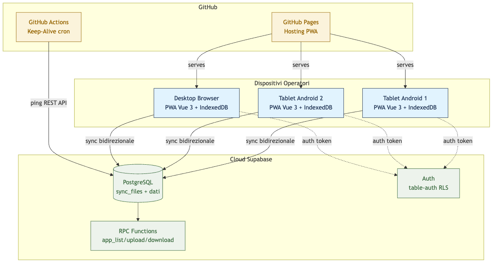
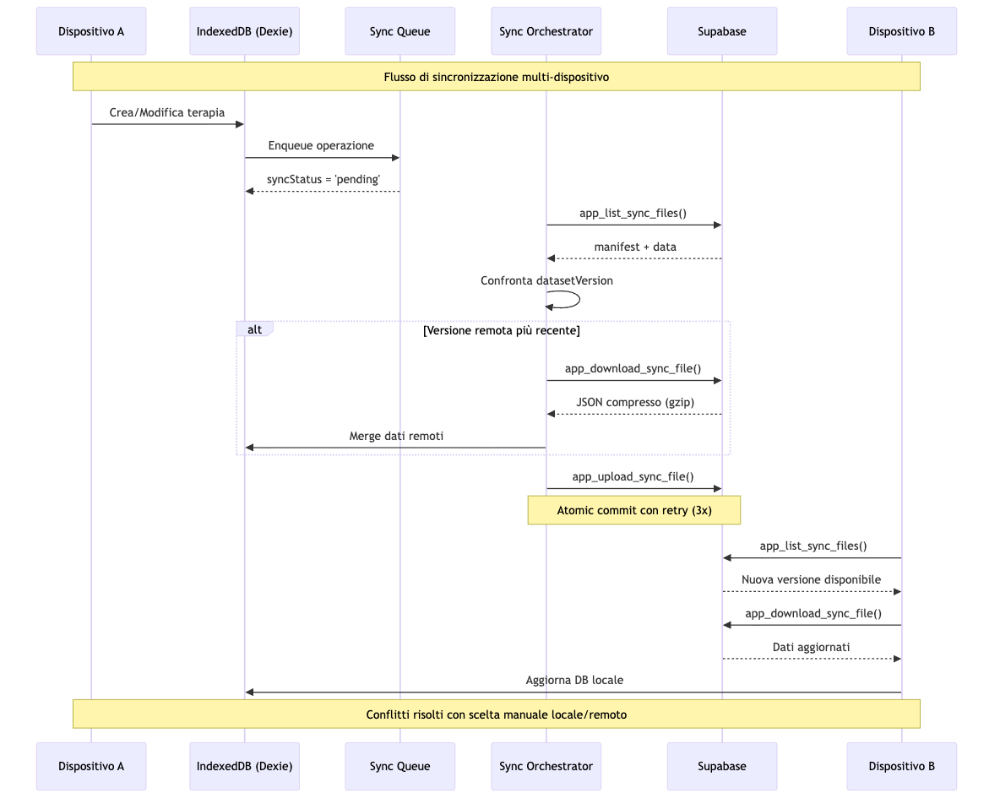
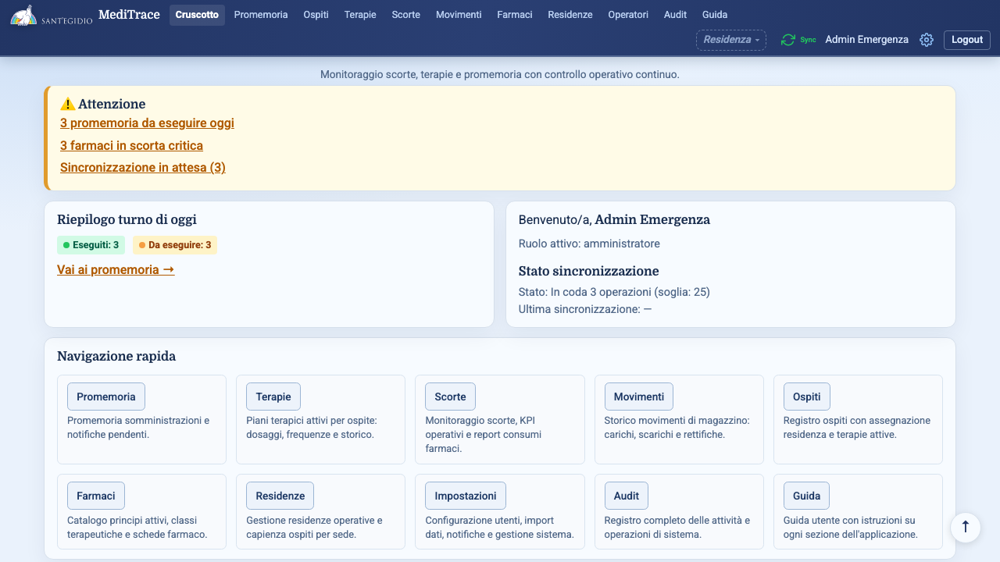
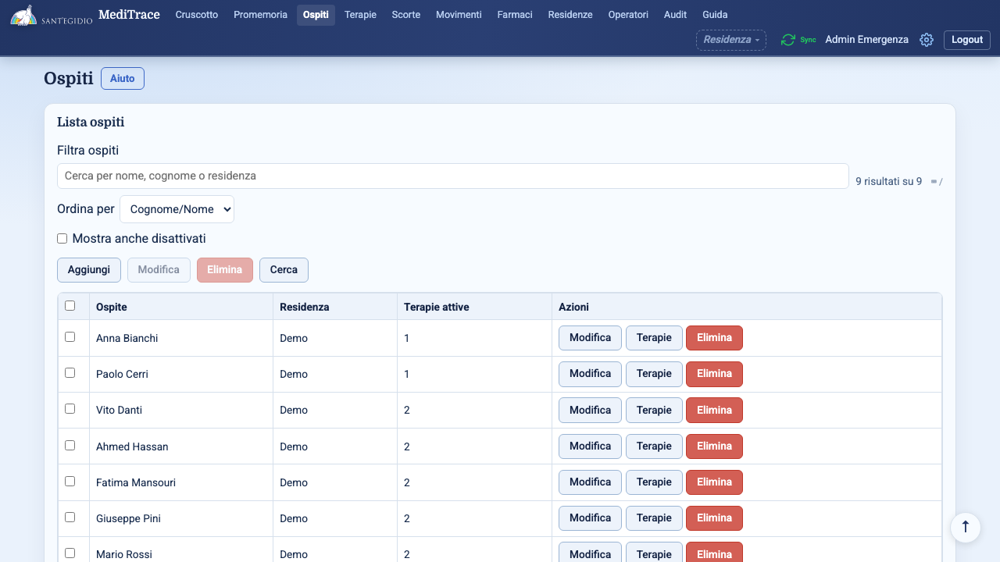
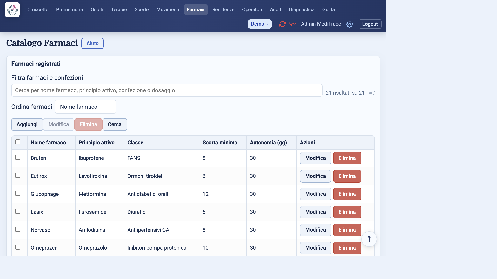
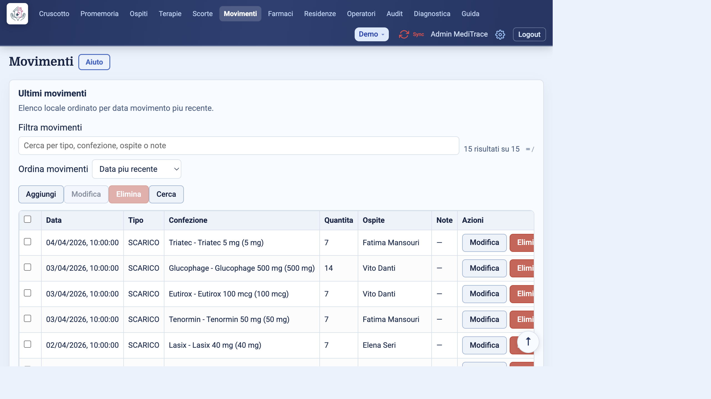
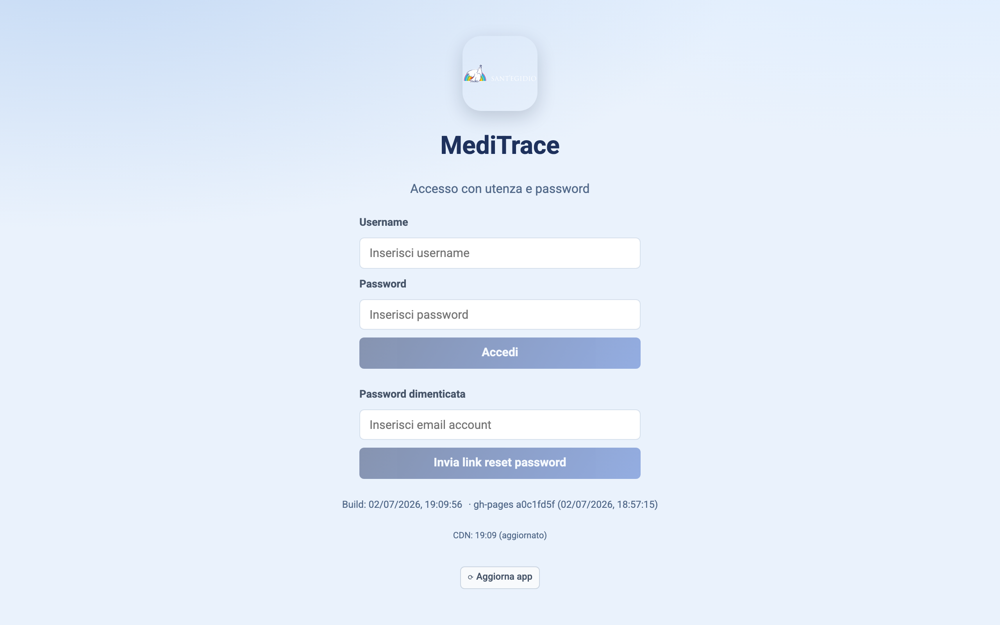
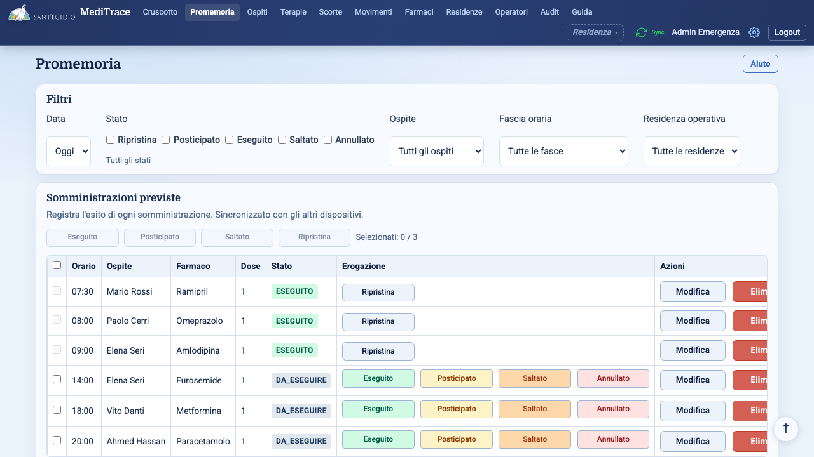
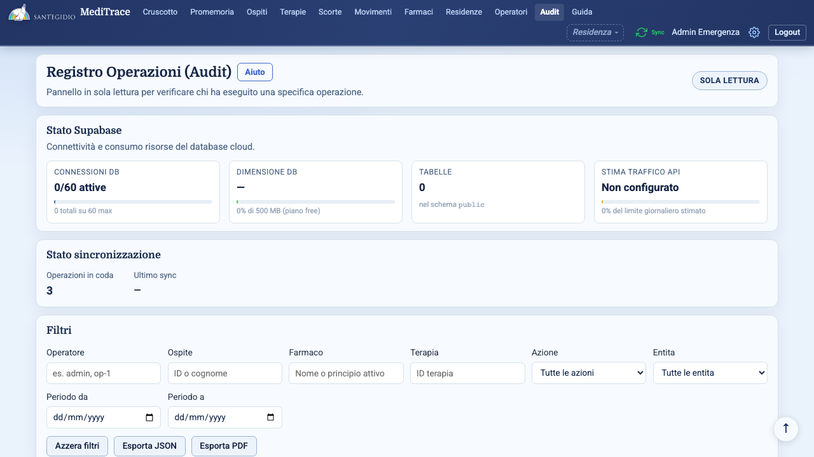

# MediTrace
## Gestione farmaci per le Residenze della Comunità di Sant'Egidio

Presentazione tecnica  ·  Luglio 2026

---

# MediTrace in numeri

  

7

Moduli

  

3

Ruoli

  

PWA

Offline-first

  

Sync

Multi-device

### Gestione farmaci
Catalogo con principio attivo, classe terapeutica, scorta minima, soglie riordino.

### Monitoraggio scorte
Report operativo con KPI, trend consumi, copertura settimanale, alert esaurimento.

### Ospiti e Residenze
Anagrafica ospiti con assegnazione stanza e storico terapie.

### Terapie e posologia
Piani terapici con dose, frequenza, orari somministrazione e durata.

### Promemoria
Notifiche per somministrazioni, scadenze e scorte in esaurimento.

### Audit e tracciabilità
Registro completo operazioni con filtri per operatore, entità, data.

---

# Architettura del sistema

---

# Flusso dati e sincronizzazione

Sync bidirezionale con compressione gzip (~80%), retry automatico, risoluzione conflitti manuale, datasetVersion per merge ottimistico.

---

# Cruscotto

Alert scorte critiche, promemoria pending, sync in coda
&nbsp;
KPI promemoria eseguiti, da eseguire, posticipati
&nbsp;
Sync stato con conteggio operazioni

---

# Ospiti

Anagrafica completa: nome, cognome, codice fiscale, data di nascita. Assegnazione stanza e letto. Ricerca avanzata con pannello filtri. Collegamento diretto alle terapie.

Soft-delete con undo 10 sec
&nbsp;
Ricerca avanzata con filtri
&nbsp;
Shortcut `/` cerca, `N` nuovo

---

# Catalogo farmaci

Nome commerciale e principio attivo. Classe terapeutica. Scorta minima e soglia autonomia in giorni. Gestione confezioni multiple per farmaco.

Lotto, dosaggio, quantità attuale. Soglia riordino personalizzabile. Data scadenza con alert. Confezione predefinita per terapia.

---

# Scorte e report

Alert farmaci sotto soglia: critici e in esaurimento
&nbsp;
KPI consumo settimanale, copertura, trend 6 mesi
&nbsp;
Export PDF e CSV

---

# Movimenti

**Carico**: rifornimento scorte.
**Scarico**: somministrazione o consumo.
Ogni movimento aggancia ospite, terapia e confezione.

Aggiornamento automatico della quantità in magazzino. Ricerca avanzata per tipo, data, ospite e farmaco.

---

# Terapie

Posologia dose, frequenza, 6 orari giornalieri
&nbsp;
Vista somministrazioni raggruppate per ospite
&nbsp;
Durata data inizio e fine con controllo sovrapposizioni

---

# Promemoria

Pianificazione automatica da terapie attive. Fasce orarie configurabili: mattina, pomeriggio, sera, notte. Stati: da eseguire, eseguito, posticipato, saltato.

Web Push API su browser compatibili
&nbsp;
Test integrato in Impostazioni
&nbsp;
Fallback agenda locale sempre disponibile

---

# Audit

Filtri operatore, ospite, farmaco, terapia, azione, entità, data
&nbsp;
Export JSON e PDF
&nbsp;
Dettaglio JSON completo di ogni evento

---

# Sicurezza

### Autenticazione

Table-Auth: token di sessione condiviso via `sync_files`. Password policy: 10+ caratteri, maiuscola, minuscola, numero, simbolo. Rate limiting su endpoint Supabase. Session TTL configurabile.

### Row Level Security

RLS su ogni tabella Supabase. `anon key`: sola lettura per bootstrap. `authenticated`: CRUD via RPC functions. 8 migration SQL versionate nel repository.

GDPR-ready &nbsp; dati sanitari solo sul dispositivo locale

---

# PWA — offline first

Service Worker per caching automatico. IndexedDB (Dexie) come database locale. Installabile su home screen Android e desktop. Manifest con nome, icone, orientamento. Chunk-load error recovery dopo deploy.

> In una residenza la connettività non è garantita. L'app deve funzionare sempre, anche senza rete.

Nessuna interruzione durante la visita ai pazienti. Sync automatico quando torna la connessione. Nessuna perdita dati: tutto salvato localmente prima del sync.

---

# Sincronizzazione

| Componente | Ruolo |
|---|---|
| `sync.js` | Orchestratore: `fullSync()` con merge snapshot-based |
| `syncBackend.js` | Selettore runtime: Supabase o GitHub Gist (legacy) |
| `supabaseSync.js` | Upload/download via RPC |
| `syncCompress.js` | Compressione gzip con `pako` (~80% riduzione) |
| `useSyncState.js` | Stato reattivo: SYNCED / PENDING / CONFLICT / ERROR / OFFLINE |

### Cosa viene sincronizzato
Ospiti, farmaci, terapie, movimenti, confezioni, promemoria, residenze, profili utente, impostazioni.

### Conflitti
Rilevamento automatico per campo. Scelta manuale: mantieni locale o accetta remoto. Tracciamento in `activityLog`.

---

# Keep-alive e automazione

### GitHub Actions

Cron ogni domenica e giovedì a mezzanotte UTC. Ping REST API Supabase: `SELECT name FROM sync_files LIMIT 1`. Previene la pausa per inattività del free tier (7 giorni).

### Client-side

Servizio `keepAlive.js` nell'app. Check ogni 6 ore: se DB inattivo da 6+ giorni, esegue un ping leggero. Toggle on/off nelle Impostazioni.

Ridondanza &nbsp; due meccanismi indipendenti

---

# Stack tecnologico

| Layer | Tecnologia |
|---|---|
| Framework | Vue 3 (Composition API) |
| Build | Vite 5 |
| Routing | Vue Router 4 (hash) |
| State | IndexedDB via Dexie.js |
| UI | CSS custom |
| PWA | vite-plugin-pwa + Workbox |

| Layer | Tecnologia |
|---|---|
| Database | Supabase PostgreSQL |
| Auth | Table-auth + RLS |
| Sync | RPC + gzip + snapshot |
| Hosting | GitHub Pages |
| CI | GitHub Actions |
| Test | Vitest + Playwright |

---

# Copertura test

  

72

Unit test

  

29

E2E

  

41

CRUD + detection

### Unit test (Vitest)

Servizi: `auth`, `sync`, `terapie`, `farmaci`, `promemoria`. Modelli: validazione form, KPI, reporting. Utility: `formatDate`, `buildOperationalReport`, CSV import.

### E2E (Playwright)

Flussi CRUD completi per ogni entità. Multi-browser: Chromium, Firefox, WebKit. Fixture CSV realistici: 30 ospiti, 30 farmaci. Test online sync con Supabase.

---

# Roadmap

| Priorità | Feature | Stato |
|---|---|---|
| Alta | Notifiche push Web API | In corso |
| Alta | Import CSV multi-sorgente | Completato |
| Media | Dashboard analytics avanzate | Pianificato |
| Media | Multi-residenza con switch | Completato |
| Bassa | Integrazione stampante termica | Ideazione |
| Bassa | App nativa Android (Capacitor) | Valutazione |
| Tech | Supabase branches per staging | Completato |
| Tech | Keep-alive automatizzato | Completato |

---

# Perché MediTrace

### Per le residenze

Riduce gli errori di somministrazione. Traccia le scorte in tempo reale. Semplifica la turnazione degli operatori. Garantisce tracciabilità completa. Nessun costo di infrastruttura server.

### Per chi sviluppa

Open source su GitHub. Stack moderno e manutenibile. 83% test coverage tra unit e E2E. Deploy automatico su GitHub Pages. Documentazione completa in `docs/`.

<strong>github.com/vgrazian/MediTrace</strong>

---

# Domande?

### MediTrace
**Gestione farmaci per le Residenze della Comunità di Sant'Egidio**

 

PWA  ·  Offline-first  ·  Sync multi-dispositivo  ·  Supabase  ·  Open source

  

Luglio 2026
&nbsp;
72 test
&nbsp;
29 E2E

