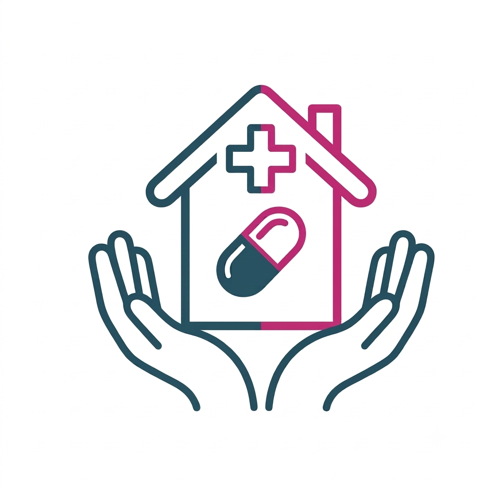

<!-- _footer: '' -->

# MediTrace
Gestione farmaci per le Residenze della Comunità di Sant'Egidio

  PWA offline-first
  Vue 3 + Supabase
  Open source

---

# Il problema

### Errori di somministrazione

Terapie cartacee o fogli Excel. Nessuna
tracciabilità. Orari sbagliati, farmaci confusi.

### Scorte non monitorate

Farmaci esauriti senza preavviso.
Scadenze non tracciate. Riordini d'emergenza.

### Nessuna continuità

Passaggi di turno senza storico.
Nessuna visibilità su cosa è stato fatto
o su cosa resta da fare.

### Zero audit

Nessuna registrazione di chi ha fatto cosa.
Impossibile risalire a errori o responsabilità.

---

# La soluzione

## Un'unica app, sempre disponibile, che guida l'operatore in ogni fase

1

**Dispositivo**  
Tablet o smartphone.
Installabile su home screen.
Funziona senza internet.

&infin;

**Sempre attivo**  
Dati locali via IndexedDB.
Sync con Supabase quando
la connessione è disponibile.

100%

**Tracciabilità**  
Ogni operazione registrata.
Audit trail completo.
GDPR-ready, dati clinici on-device.

---

# Cosa fa MediTrace

<h3>Cruscotto</h3>
KPI turno · Alert scorte · Stato sync · Promemoria in scadenza

<h3>Ospiti</h3>
Anagrafica · Assegnazione stanza/letto · Ricerca avanzata · Soft-delete

<h3>Farmaci</h3>
Catalogo principi attivi · Confezioni multiple · Lotto/scadenza · Scorta minima

<h3>Terapie e Promemoria</h3>
Piano terapeutico · Turni personalizzabili per residenza · Push notification · Azioni batch

<h3>Scorte e Movimenti</h3>
Report KPI · Consumo settimanale · Copertura giorni · Carico/scarico · Export PDF/CSV

<h3>Audit e Diagnostica</h3>
Registro operazioni · Filtri avanzati · Dettaglio JSON · Dashboard Axiom integrata

<h3>Multi‑tenancy</h3>
Accesso per residenza · Ruoli admin/operatore · Turni orari per sede · Password policy

<h3>Import CSV</h3>
Caricamento massivo · Compatibile Google Sheets · Validazione automatica

---

<!-- _footer: '' -->

# Numeri del progetto

15

viste applicative

146

test E2E Playwright

83%

code coverage

8

migration SQL Supabase

3

residenze multi‑tenant

Vue 3 Composition API
Vite 5
Dexie.js IndexedDB
Supabase PostgreSQL
Workbox PWA
GitHub Pages

---

# Architettura

---

# Stack — Frontend

| Categoria | Tecnologia | Ruolo |
|---|---|---|
| Framework | Vue 3 | Composition API, reattività |
| Build | Vite 5 | Dev server, HMR, bundling |
| Routing | Vue Router 4 | Lazy loading, guard |
| Store locale | Dexie.js | IndexedDB, transazioni |
| Stile | CSS vanilla | Nessun framework UI esterno |
| PWA | vite-plugin-pwa + Workbox | Service Worker, caching, install |
| Test | Vitest + Playwright | 72 unit + 146 E2E |

---

# Stack — Backend & Infra

| Categoria | Tecnologia | Ruolo |
|---|---|---|
| Database | Supabase PostgreSQL | Dati operativi e sync |
| Auth | Table-auth + RLS | Accesso per residenza, ruoli |
| Email | Supabase Edge Function | Reset password via Gmail SMTP |
| Realtime | Supabase Realtime | Sync multi-dispositivo |
| Hosting | GitHub Pages | Deploy automatico |
| CI/CD | GitHub Actions | Build, test, keep-alive |
| Monitoring | Axiom | Log analytics, diagnostica |
| Sicurezza | 8 migration SQL | RLS, policy, audit nativo |

---

# Cruscotto

KPI del turno · Alert scorte critiche · Promemoria in scadenza · Stato sync

---

# Ospiti

Anagrafica completa · Assegnazione stanza/letto · Ricerca avanzata · Soft-delete

---

# Catalogo farmaci

Principio attivo · Nome commerciale · Confezioni · Lotto · Scadenza · Scorta minima

---

# Terapie

Piano terapeutico · Dose, frequenza · 6 orari/giorno · Data inizio/fine · Quick-add

---

# Promemoria

Pianificazione automatica · Turni orari per residenza · Stati multipli · Azioni batch

---

# Scorte

Report KPI · Consumo settimanale · Copertura · Trend 6 mesi · Export PDF/CSV

---

# Movimenti

Carico/scarico · Aggancio a ospite/terapia/confezione · Ricerca avanzata · Validazione

---

# Audit

Registro completo · Filtro operatore · Dettaglio JSON · Export PDF · Dashboard Axiom

---

# Funzionalità recenti

### Turni personalizzabili per residenza

Ogni residenza può avere i propri turni (Mattina, Pomeriggio, Sera, Notte) con orari indipendenti. Configurabili dal pannello Residenze o Impostazioni. Override automatico dei turni globali.
 
Luglio 2026

### Reset password autonomo

Ogni operatore può reimpostare la propria password dal login tramite link email. Invio via Edge Function Supabase + Gmail SMTP. Token monouso con scadenza configurabile.
 
Luglio 2026

### Diagnostica integrata

Dashboard Axiom accessibile direttamente dal pannello Audit: panoramica operatori, heatmap percorsi, errori raggruppati. Nessun tab separato.
 
Luglio 2026

### Dati demo per analytics

Trend consumi e grafici mostrano dati sintetici significativi anche in modalità demo. Utile per valutazione e formazione senza dati reali.
 
Luglio 2026

---

# Flusso di lavoro — Turno

<h3 style="font-family:'Newsreader',Georgia,serif;font-size:1.15rem;color:var(--brand);margin-bottom:.8rem">Inizio turno</h3>

<h3>Login</h3>
Credenziali personali, autenticazione locale+remota

<h3>Cruscotto</h3>
Verifica KPI, alert scorte, promemoria in scadenza

<h3>Promemoria</h3>
Apri il turno corrente. Lista somministrazioni

<h3 style="font-family:'Newsreader',Georgia,serif;font-size:1.15rem;color:var(--brand);margin-bottom:.8rem">Giro terapia</h3>

<h3>Scheda ospite</h3>
Apri da promemoria &rarr; verifica terapia &rarr; conferma dose

<h3>Esito</h3>
Eseguito / Posticipato / Saltato &rarr; eventuale nota

<h3>Scarico</h3>
Se farmaco esaurito: Movimenti &rarr; scarico automatico

---

# Flusso di lavoro — Continuità

<h3 style="font-family:'Newsreader',Georgia,serif;font-size:1.15rem;color:var(--accent);margin-bottom:.8rem">Passaggio di turno</h3>

**Promemoria in sospeso** — filtrati per stato "da eseguire". Note su terapie saltate o posticipate. Verifica scorte per il fabbisogno del turno successivo.

**Nessun foglio perso** — tutto registrato in Audit, cronologia sempre disponibile per ogni ospite.

<h3 style="font-family:'Newsreader',Georgia,serif;font-size:1.15rem;color:var(--accent);margin-bottom:.8rem">Operazioni periodiche</h3>

**Import CSV** — carico iniziale o aggiornamento massivo da Google Sheets

**Movimenti** — carico periodico da farmacia con aggiornamento automatico quantità

**Scorte** — verifica scadenze, riordino, report mensile di consumo

**Audit** — controllo qualità, conformità normativa, statistiche operatore

---

# Sincronizzazione

---

# Sicurezza

### Autenticazione
- Table-auth con session token
- Password policy: 10+ caratteri, maiuscola, minuscola, numero, simbolo
- Reset password autonomo via email (Edge Function + Gmail SMTP)
- Session TTL configurabile
- Due ruoli: `admin` e `operator`

### Row Level Security
- RLS su ogni tabella Supabase
- CRUD via RPC functions autenticate
- 8 migration SQL versionate
- Accesso filtrato per residenza

### Privacy

I dati clinici risiedono **solo sul dispositivo locale** (IndexedDB). Nessun dato sanitario transita su server cloud. La sincronizzazione scambia solo metadati operativi e stato delle scorte.

**GDPR-ready** — architettura progettata per la minimizzazione del dato: su Supabase transitano solo ID, quantità e log operativi, non dati clinici degli ospiti.

---

# Qualità e test

72

unit test servizi, modelli, KPI, reporting

146

test E2E flussi CRUD, multi‑browser, sync

83%

copertura tra unit ed E2E

41 test CRUD
Duplicate detection
30 ospiti fixture
30 farmaci fixture
CI/CD su ogni PR

---

# Roadmap

| Stato | Feature | Dettaglio |
|---|---|---|
| ✅ | PWA offline-first | Service Worker, IndexedDB, installabile |
| ✅ | Sync multi-dispositivo | Supabase Realtime + Direct API |
| ✅ | Multi-residenza | Switch residenza, turni personalizzabili per sede |
| ✅ | Reset password via email | Edge Function + Gmail SMTP, link monouso |
| ✅ | Import CSV | Multi-sorgente, validazione automatica |
| ✅ | Diagnostica integrata | Dashboard Axiom nel pannello Audit |
| ✅ | Audit trail | Registro completo, export JSON/PDF |
| 🔄 | Push notification | Web Push API, notifiche promemoria |
| 📋 | Analytics avanzate | Dashboard consumi, trend predittivi |
| 📋 | App nativa Android | Capacitor wrapper, notifiche native |

---

# Link e accesso

### Risorse

**App live**  
[vgrazian.github.io/MediTrace](https://vgrazian.github.io/MediTrace/)

**Repository**  
[github.com/vgrazian/MediTrace](https://github.com/vgrazian/MediTrace)

**Documentazione**  
`docs/` — requisiti tecnici, flussi navigazione, schema JSON, runbook operativo

### Credenziali demo

| Ruolo | Utente |
|---|---|
| Admin | `valerio` |
| Admin | `anna` |
| Admin | `admin` |

Dati demo 3 residenze · 10 ospiti · 10 farmaci · terapie attive · promemoria giornalieri

---

<!-- _footer: '' -->

# Grazie

### MediTrace
Gestione farmaci per le Residenze della Comunità di Sant'Egidio

  PWA
  Offline‑first
  Sync multi‑dispositivo
  Supabase
  Open source

  <a href="https://github.com/vgrazian/MediTrace">github.com/vgrazian/MediTrace</a>

Luglio 2026

