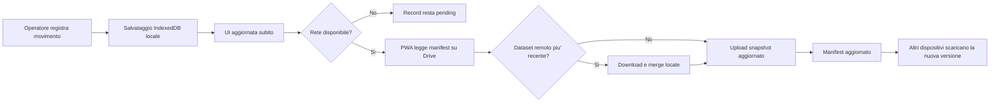

# Wireframe e Flussi UX

## Schermate MVP

### Dashboard

- card con farmaci sotto soglia
- card con sincronizzazione in sospeso
- lista ordini da preparare
- accesso rapido a carico e scarico

### Farmaci

- elenco ricercabile
- dettaglio farmaco con soglia e disponibilita'
- storico movimenti recenti

### Movimenti

- azione rapida carico
- azione rapida scarico
- causale obbligatoria
- salvataggio immediato in locale

### Ordini

- elenco farmaci da ordinare
- priorita'
- quantita' suggerita
- stato ordine

## Adattivita' UI (Telefono e Tablet)

### Breakpoint consigliati

- compact: larghezza < 600dp (telefoni)
- medium: larghezza 600-839dp (phablet / small tablet)
- expanded: larghezza >= 840dp (tablet)

### Pattern layout

- compact: una colonna, bottom navigation, dettaglio a pagina separata
- medium: una colonna con pannelli comprimibili e azioni in sticky footer
- expanded: due colonne (lista + dettaglio), comandi rapidi sempre visibili

### Regole pratiche

- target touch minimo 48dp
- font scalabile senza clipping
- tabelle dense sostituite da card su compact
- indicatori critici (alert terapia/scorte) sempre in area visibile above the fold

## Aggiornamenti e Backup (UX)

- mostrare in impostazioni: versione app, versione schema dati, data ultimo backup
- offrire azione esplicita `Esegui backup ora`
- durante aggiornamento con migrazione, mostrare stato progressivo e bloccare azioni critiche
- in caso di restore, mostrare riepilogo dati ripristinati prima di riaprire il turno

## Flusso principale

## Linee guida UI

- interfaccia ad alto contrasto e leggibile in contesto clinico
- azioni critiche sempre visibili
- stato sync sempre esplicito
- alert di riordino distinguibili ma non allarmistici
- inserimento dati ottimizzato per pochi tocchi
- comportamento consistente tra telefono e tablet con variazione solo di layout, non di flusso
