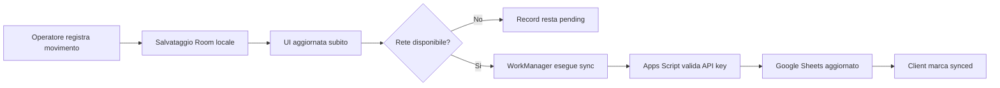

# Wireframe e Flussi UX

## Schermate MVP

### Dashboard

- card con farmaci sotto soglia
- card con sincronizzazione in sospeso
- lista ordini da preparare
- accesso rapido a carico e scarico

### Farmaci

- elenco ricercabile
- dettaglio farmaco con soglia e disponibilita'
- storico movimenti recenti

### Movimenti

- azione rapida carico
- azione rapida scarico
- causale obbligatoria
- salvataggio immediato in locale

### Ordini

- elenco farmaci da ordinare
- priorita'
- quantita' suggerita
- stato ordine

## Flusso principale

## Linee guida UI

- interfaccia ad alto contrasto e leggibile in contesto clinico
- azioni critiche sempre visibili
- stato sync sempre esplicito
- alert di riordino distinguibili ma non allarmistici
- inserimento dati ottimizzato per pochi tocchi
